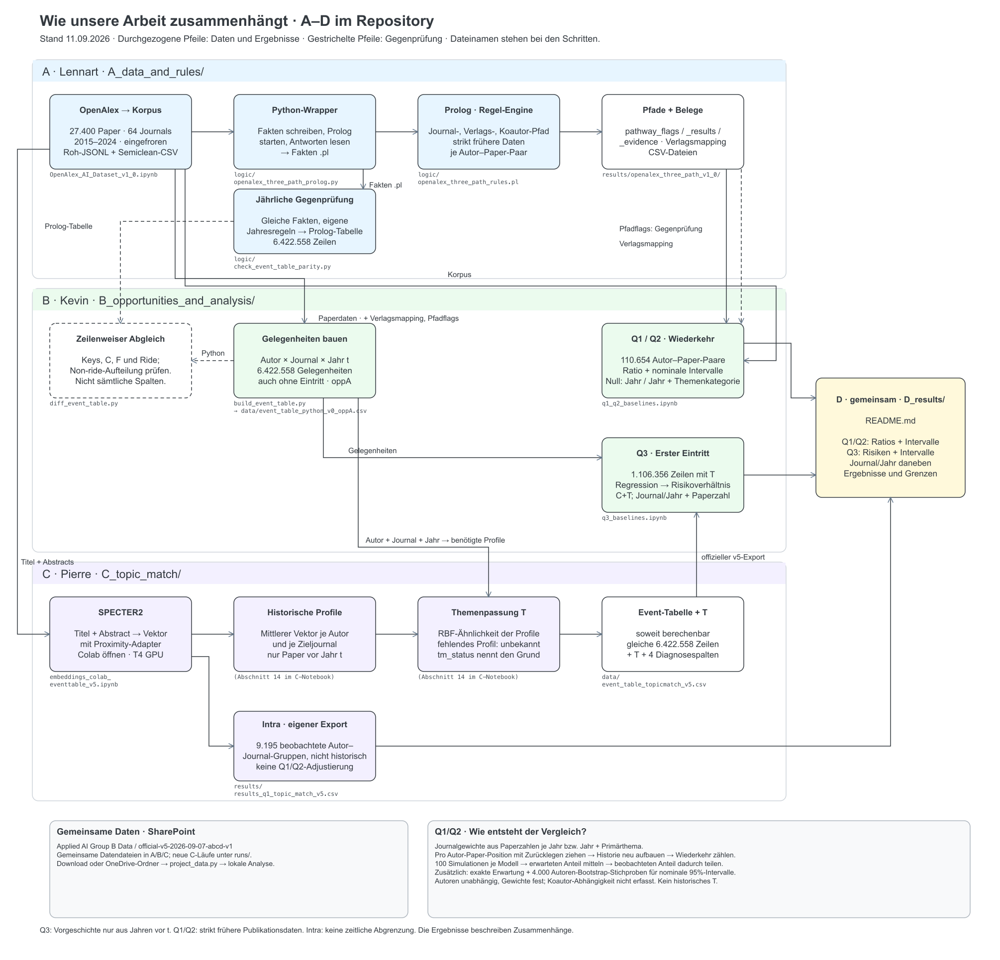

# Publication patterns in AI journals

This is our student project on 27,400 papers from 64 AI journals, published between 2015 and 2024. We look at three questions:

- Q1: Do authors return to the same journal more often than expected?
- Q2: Do they return to the same publisher more often?
- Q3: Is a previous co-author connection associated with entering a new journal, also when we account for topic fit?

## What each part does

- [A · Lennart](A_data_and_rules/README.md): collects the papers and uses Prolog to find earlier publication paths.
- [B · Kevin](B_opportunities_and_analysis/README.md): builds the entry opportunities and calculates Q1, Q2 and Q3.
- [C · Pierre](C_topic_match/README.md): turns paper texts into vectors and compares authors' and journals' earlier topics.
- [D · Results](D_results/README.md): brings together the results, our decisions and how we interpret them.

The code is here. The large data files are in our shared SharePoint folder, with the same A/B/C structure.

<a id="how-to-use-it"></a>

## How to run the project

These steps use the shared data and calculate the results again. You need Git and Python 3.12 or newer. The terminal commands below are the ones we use on macOS.

### 1. Get the code

```sh
git clone https://github.com/Mista-Kev/academic-journals.git
cd academic-journals
python3 -m venv .venv
source .venv/bin/activate
python -m pip install -r requirements.txt
```

When you come back later, open this folder and run `source .venv/bin/activate` again.

### 2. Get the data

Open the SharePoint link from our team chat. In **Applied AI Group B Data**, download and unzip **official-v5-2026-09-07-abcd-v1**. A synced OneDrive copy also works.

Replace the path below with your downloaded folder. Choose the folder containing A/B/C and `START_HERE.txt`.

```sh
python project_data.py configure --group q1-q2 --shared-root "/path/to/official-v5-2026-09-07-abcd-v1"
python project_data.py fetch --group q1-q2
python project_data.py fetch --group q3
python project_data.py fetch --group parity
```

This copies the needed files into the project and checks that they match our shared version. You should see `verified` for each file. If a file is missing or different, check the download before continuing.

### 3. Calculate Q1 and Q2

```sh
python demo.py q1-q2
```

This runs [q1_q2_baselines.ipynb](B_opportunities_and_analysis/q1_q2_baselines.ipynb). It compares observed recurrence with simulated publication histories.

You should get Q1 **3.09 / 2.22**, Q2 wide **2.02 / 1.69**, and Q2 narrow **1.16 / 1.11**. The first number uses the year; the second also uses the topic category. The intervals are printed separately.

### 4. Calculate Q3

```sh
python demo.py q3
```

This runs [q3_baselines.ipynb](B_opportunities_and_analysis/q3_baselines.ipynb). It compares predicted first-entry probabilities with and without a previous co-author connection.

With topic fit, the ratios are **6.09** for all entries and **3.34** for entries without a ride. Adding journal and year on matched rows gives **2.27 / 1.18**. Also adding previous paper count gives **2.29 / 1.21**. Each model prints its interval.

Both commands take about a minute on our machine and finish with `Completed q1-q2` or `Completed q3`. They run the notebook code; they do not just print its saved results.

Read [D · Results](D_results/README.md) alongside the numbers. Q1/Q2 depend on the comparison model we chose. Q3 changes substantially with journal and year. These are associations, not proof of causation; D also explains the interval assumptions.

### 5. Compare the Python and Prolog tables

```sh
python B_opportunities_and_analysis/diff_event_table.py
```

Expected: **6,422,558 matching rows**, zero disagreements and `VERDICT: identical`. This compares the keys and connection, entry and ride indicators, not every column or the topic values.

## Run Pierre's topic calculation

[Open the C notebook in Colab](https://colab.research.google.com/github/Mista-Kev/academic-journals/blob/main/C_topic_match/embeddings_colab_eventtable_v5.ipynb) and select a T4 GPU.

Section 3 lists the three files to download from SharePoint and upload into Colab. Run the cells in order. The embeddings take about 16 minutes, plus file transfers and the remaining calculations. Section 15 downloads the new results as a ZIP. Unzip it and put the new run folder under `runs/` in SharePoint.

The commands above use the official release. New Colab runs stay separate so we keep the same inputs for our reported results.

## How the parts connect


