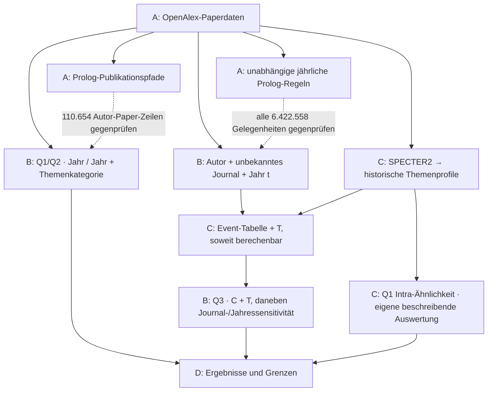

# Publication patterns in AI journals

We study 27,400 papers from 64 journals, published between 2015 and 2024:

- **Q1:** Do authors return to the same journal more often than our reference models predict?
- **Q2:** Do they return to the same publisher more often?
- **Q3:** Is a prior co-author connection associated with first entry into a journal, after accounting for topic fit?

Our results describe publication patterns and adjusted associations. They do not
establish causal effects. [Read the results](D_results/README.md).

## How to use it

You can rerun Q1/Q2 and Q3 from the shared data without collecting new papers or
running the embedding model. You need Python 3.12 or newer and access to our
SharePoint folder, **Applied AI Group B Data**.

1. Download and extract its **official-v5-2026-09-07-abcd-v1** subfolder, or make
   that folder available locally through OneDrive. It contains A/B/C folders and
   `START_HERE.txt`.
2. Open a terminal in this repository's root folder, where `requirements.txt` is.
3. Run the commands below, replacing the example path with your downloaded folder:

```sh
python3 -m pip install -r requirements.txt
python3 project_data.py configure --shared-root "/path/to/official-v5-2026-09-07-abcd-v1"
python3 demo.py q1-q2
python3 demo.py q3
```

The last two commands run the notebooks and print their results in the terminal.
They do not change the saved notebook outputs or upload anything. The loader checks
that the input files match our shared version and keeps a local copy for later runs.

To read the calculations alongside the output, open
[Q1/Q2](B_opportunities_and_analysis/q1_q2_baselines.ipynb) or
[Q3](B_opportunities_and_analysis/q3_baselines.ipynb).
[Data setup](D_results/methods/shared-data.md#how-to-use-it) covers partial downloads
and common problems. [Running and explaining the analyses](D_results/DEMO.md)
also covers the Python/Prolog comparison.

## Where things are

| Part | Who | What it contains |
|---|---|---|
| [A · Data and rules](A_data_and_rules/README.md) | Lennart | Paper preparation, publication paths and Prolog checks |
| [B · Opportunities and analysis](B_opportunities_and_analysis/README.md) | Kevin | Annual entry opportunities and the Q1/Q2/Q3 calculations |
| [C · Topic fit](C_topic_match/README.md) | Pierre | Historical topic fit for Q3 and a separate within-journal similarity summary for Q1 |
| [D · Results](D_results/README.md) | Together | Findings, interpretation and methods |

Code and explanations are in GitHub. Large data files are in SharePoint, using
the same A/B/C paths. Each output stays with the part that produces it.

## How the parts connect



Annual rules and topic profiles use papers from years **before the year t being
analysed**. Q1/Q2 also use year and topic-category reference models. Pierre's Q1
Intra summary is separate: it does not add historical topic adjustment to those ratios.

For the reasoning behind the calculations, start with
[inputs, calculations and outputs](D_results/methods/analysis-interfaces.md).
The [methods index](D_results/methods/README.md) links the decisions and historical plans.
