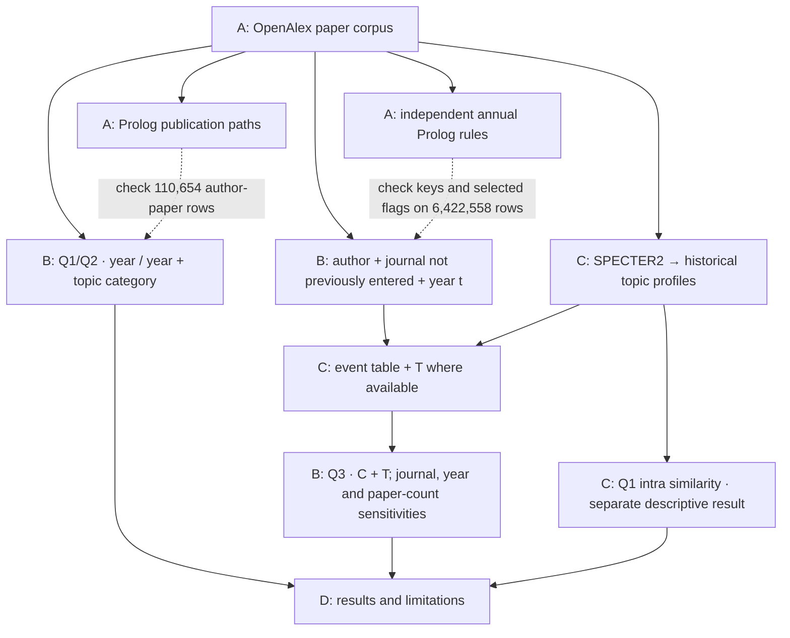

# Publication patterns in AI journals

We study 27,400 papers from 64 journals, published between 2015 and 2024:

- **Q1:** Do authors return to the same journal more often than our reference models predict?
- **Q2:** Do they return to the same publisher more often?
- **Q3:** Is a prior co-author connection associated with first entry into a journal, after accounting for topic fit?

Our results describe publication patterns and adjusted associations. They do not
establish causal effects. [Read the results](D_results/README.md).

<a id="how-to-use-it"></a>

## How to run the project

This reruns Q1/Q2 and Q3 from the official data and checks the saved Python/Prolog
outputs. Use the same steps for the presentation or an independent run.

### 1. Set up

Requires Git and Python **3.12 or newer**; tested on macOS with Python 3.12. Allow **10 GB
free disk space** for the download, working copies, packages and temporary sorting.
The test machine had 32 GB RAM; a minimum RAM requirement has not been established.
No GPU, rclone or SWI-Prolog is needed for these steps. Native Windows is not a
tested route; the table comparison requires Unix `sort` (WSL is also untested).

```sh
git clone https://github.com/Mista-Kev/academic-journals.git academic-journals-demo
cd academic-journals-demo
python3 -c "import sys; sys.exit(0 if sys.version_info >= (3, 12) else 'Python 3.12 or newer is required.')" && \
python3 -m venv .venv && \
source .venv/bin/activate && \
python -m pip install -r requirements.txt
```

Run all following commands from this folder, with `.venv` active.

### 2. Load the shared data

In OneDrive/SharePoint, open the team folder **Applied AI Group B Data**, then
**official-v5-2026-09-07-abcd-v1**, using an account with access. Download and extract it, or make the OneDrive folder
fully available offline. If the folder is missing or access is denied, ask the team for access and the
folder link before continuing.

Replace the example path below with the folder containing **A/B/C and
`START_HERE.txt`**. The release is about 2.65 GB; the files copied into your project folder add
1.76 GB. The first command stops copying if less than 6 GiB remains on the working disk.

```sh
python -c "import shutil,sys; free=shutil.disk_usage('.').free; print(f'{free/1024**3:.1f} GiB free'); sys.exit(0 if free >= 6*1024**3 else 'At least 6 GiB free is needed before fetching data.')" && \
python project_data.py configure --group q1-q2 --shared-root "/path/to/official-v5-2026-09-07-abcd-v1" && \
python project_data.py fetch --group q1-q2 && \
python project_data.py fetch --group q3 && \
python project_data.py fetch --group parity
```

Expected: `fetched and verified` or `verified` for each input, with no error.
This checks file sizes and hashes against the manifest. The notebook reads the
verified local copies; it does not mount or log into SharePoint itself.

### 3. Run and read the results

| Step | Command | What you should see |
|---|---|---|
| Q1/Q2: compare recurrence with the reference models | `python demo.py q1-q2` | Q1: **3.09 / 2.22**. Q2 wide: **2.02 / 1.69**. Q2 narrow: **1.16 / 1.11**. Each pair is year / year plus topic category. Intervals are printed separately. |
| Q3: compare first-entry probabilities with and without a prior connection | `python demo.py q3` | C + T: **6.09** for all entries, **3.34** for non-ride entries. On matched rows, adding journal and year gives **2.27 / 1.18**; also adding prior paper count gives **2.29 / 1.21**. Intervals are printed with each model. |
| Compare the Python and Prolog tables | `python B_opportunities_and_analysis/diff_event_table.py` | **6,422,558 rows**, zero key/flag disagreements and **`VERDICT: identical`**. Compares opportunity keys, connection, entry and ride indicators, not every column or T. |

Allow roughly one minute per command on the tested machine; other machines may
take longer. Each analysis ends with `Completed q1-q2` or `Completed q3`.
`demo.py` executes the actual notebook cells and prints newly calculated results;
it does not change saved notebook outputs or upload files.

The comparison uses temporary disk space. If needed, add
`--temp-dir "/path/to/folder/on/another/disk"` to its command.

Read [D · Results](D_results/README.md) alongside the output. Q1/Q2 ratios describe
recurrence relative to specific reference models. Q3 reports associations, not
causal effects; its sensitivity to journal/year adjustment belongs in the conclusion.
The intervals have sampling and dependence assumptions described there.

### If a step fails

- Stop at the error; an earlier result is not evidence that the remaining steps ran.
- **Missing data or wrong folder:** repeat step 2 with the extracted release root.
  Unset `ACADEMIC_JOURNALS_SHARED_ROOT` if it overrides your saved folder incorrectly.
- **Hash mismatch:** preserve any intentional edits and restore the matching official
  file. Do not edit the manifest or bypass verification.
- **Missing package:** activate `.venv` and rerun the requirements installation.
- **Disk full or interrupted run:** free space or use another disk, then rerun the
  failed command. Each analysis command starts a fresh calculation.
- **Nonzero comparison differences:** stop and check the input versions; do not
  report the tables as matching.

These steps reuse the official A outputs and Pierre's v5 topic values. They do
not fetch new OpenAlex data, regenerate Prolog outputs or rerun SPECTER2.
Rebuilding the A and C outputs requires additional steps. That full workflow has
not yet been tested end to end.

Optional German walkthroughs: [project and results](FELIX_PROJEKT_DURCHGEHEN.html)
and [step-by-step demo](DEMO_SCHRITT_FUER_SCHRITT.html). Open the downloaded HTML
files in a browser; GitHub displays their source. They use the same commands.

## Where things are

| Part | Who | What it contains |
|---|---|---|
| [A · Data and rules](A_data_and_rules/README.md) | Lennart | Paper preparation, publication paths and Prolog checks |
| [B · Opportunities and analysis](B_opportunities_and_analysis/README.md) | Kevin | Annual entry opportunities and the Q1/Q2/Q3 calculations |
| [C · Topic fit](C_topic_match/README.md) | Pierre | Historical topic fit for Q3 and a separate within-journal similarity summary for Q1 |
| [D · Results](D_results/README.md) | Together | Findings, interpretation and methods |

Code and explanations are in GitHub. Large data files are in SharePoint, using
the same A/B/C paths. Each output stays with the part that produces it.

## How the parts connect



Annual rules and topic profiles use papers from years **before the year t being
analysed**. Q1/Q2 also use year and topic-category reference models. Pierre's Q1
Intra summary is separate: it does not add historical topic adjustment to those ratios.

For the reasoning behind the calculations, start with
[B](B_opportunities_and_analysis/README.md).
[D](D_results/README.md#choices-and-history) records the main choices and changes.
