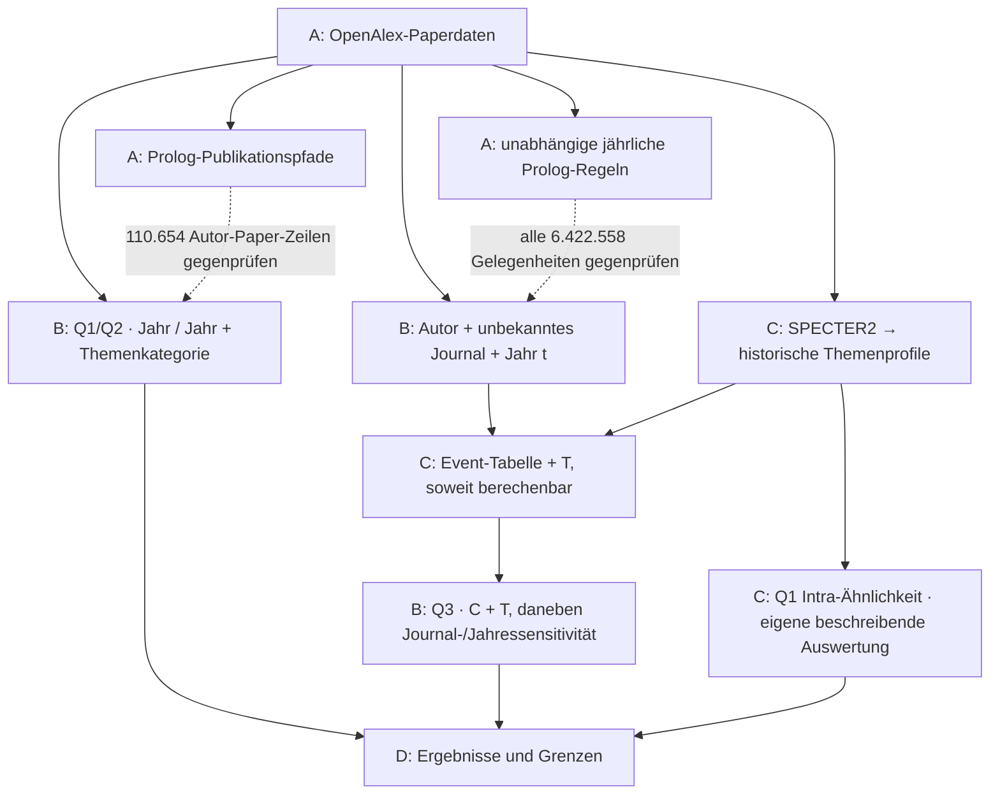

# Publication patterns in AI journals

We study 27,400 papers from 64 journals, published between 2015 and 2024:

- **Q1:** Do authors return to the same journal more often than our reference models predict?
- **Q2:** Do they return to the same publisher more often?
- **Q3:** Is a prior co-author connection associated with first entry into a journal, after accounting for topic fit?

Our results describe publication patterns and adjusted associations. They do not
establish causal effects. [Read the results](D_results/README.md).

## How to use it

You can rerun Q1/Q2 and Q3 with Python 3.12 or newer and the shared data.
No GPU, Colab, rclone, Prolog or OpenAlex API key is needed for these two analyses.

1. Obtain access to **Applied AI Group B Data** from the team. Download and extract
   **official-v5-2026-09-07-abcd-v1**, or make that folder available locally through
   OneDrive. Select the folder containing A/B/C and `START_HERE.txt`.
2. Get the repository from GitHub. The commands below use Git; downloading the
   repository ZIP and opening a terminal in its extracted root also works.
3. Install the dependencies in a virtual environment, configure your data folder,
   and run both analyses. Replace the example data path with your own.

```sh
git clone https://github.com/Mista-Kev/academic-journals.git academic-journals-demo
cd academic-journals-demo
python3 -m venv .venv
source .venv/bin/activate
python -m pip install -r requirements.txt
python project_data.py configure --shared-root "/path/to/official-v5-2026-09-07-abcd-v1"
python demo.py q1-q2
python demo.py q3
```

On Windows, create the environment with `py -3 -m venv .venv` using Python 3.12
or newer. Skip `source`; use `.\.venv\Scripts\python.exe` instead of `python`
in the remaining commands. If you downloaded the repository ZIP, skip the clone
and `cd` commands and start in its extracted root.

The loader checks the shared inputs and copies them locally on first use. Later
runs can use these copies offline. Each analysis ends with `Completed q1-q2` or
`Completed q3` and its runtime. Allow a few minutes per analysis depending on the
machine. The terminal results are newly calculated; saved notebook outputs are
not overwritten and nothing is uploaded.

Look for Q1 **3.09 / 2.22**, Q2 wide **2.02 / 1.69** and narrow **1.16 / 1.11**
(year / year + topic), plus their nominal intervals. Q3 reports non-ride **3.34**;
its journal/year comparison on matched rows is **3.30 → 1.18**. The final
`0.683 (not Q3)` in the Q1/Q2 notebook is a contrasting example, not the Q3 result.
[Results and interpretation](D_results/README.md).

To read the calculations alongside the output, open
[Q1/Q2](B_opportunities_and_analysis/q1_q2_baselines.ipynb) or
[Q3](B_opportunities_and_analysis/q3_baselines.ipynb).
The [B README](B_opportunities_and_analysis/README.md) explains the calculations.
Setup problems and optional checks are below.

## Where things are

| Part | Who | What it contains |
|---|---|---|
| [A · Data and rules](A_data_and_rules/README.md) | Lennart | Paper preparation, publication paths and Prolog checks |
| [B · Opportunities and analysis](B_opportunities_and_analysis/README.md) | Kevin | Annual entry opportunities and the Q1/Q2/Q3 calculations |
| [C · Topic fit](C_topic_match/README.md) | Pierre | Historical topic fit for Q3 and a separate within-journal similarity summary for Q1 |
| [D · Results](D_results/README.md) | Together | Findings, interpretation and methods |

Code and explanations are in GitHub. Large data files are in SharePoint, using
the same A/B/C paths. Each output stays with the part that produces it.

## How the parts connect



Annual rules and topic profiles use papers from years **before the year t being
analysed**. Q1/Q2 also use year and topic-category reference models. Pierre's Q1
Intra summary is separate: it does not add historical topic adjustment to those ratios.

For the reasoning behind the calculations, start with
[B](B_opportunities_and_analysis/README.md).
[D](D_results/README.md#choices-and-history) records the main choices and changes.

## Setup help

- Configure the folder containing A/B/C and `START_HERE.txt`. For OneDrive,
  make the files available locally. The release contains about 2.65 GB of data.
- For partial downloads, add `--group q1-q2` or `--group q3` to `configure`.
  `python3 project_data.py list --group q3` lists that group's inputs.
- A checksum mismatch means the file differs from the shared version. Preserve
  intentional edits and obtain the matching file. Do not change the manifest hash.
- Unset `ACADEMIC_JOURNALS_SHARED_ROOT` if it conflicts with your saved folder.
  Other options are listed by `python3 project_data.py --help`.
- If hard links are unsupported, use a writable local cache/staging directory
  that supports them, reading from your downloaded or synced source.

<details>
<summary>Optional checks and sharing a new version</summary>

Compare the existing Python/Prolog tables and run the software tests:

```sh
python3 project_data.py fetch --group parity
python3 B_opportunities_and_analysis/diff_event_table.py
python3 -m unittest discover -s . -v
```

Install SWI-Prolog to include its integration tests and Git for the checkout test.
Only loader/builder tests: `python3 -m unittest discover -s B_opportunities_and_analysis/tests -p 'test_*.py' -v`.
For a rebuild, use [A's instructions](A_data_and_rules/logic/README.md) and
[B's builder](B_opportunities_and_analysis/README.md#rebuild-the-opportunity-table).

After reviewing a new data version and its manifest:

```sh
python3 project_data.py verify --group all
python3 project_data.py prepare-release --target /path/to/new-release
python3 project_data.py verify-release --target /path/to/new-release
```

Use a dedicated empty folder outside the repository; it must not contain the
repository either. A group-only `stage` folder is not a complete release.
The release includes the declared data plus instructions, inventory, manifest and
receipt. Changed data or generated metadata require a new release folder.
Publish matching code, upload, download separately and verify that download.
Preserve the previous release. The notebooks never upload results automatically.

</details>
