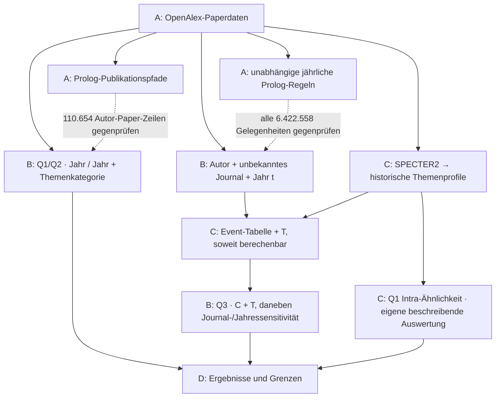

# Publikationswege in KI-Journals

Wir untersuchen beobachtete Publikationen: Wiederkehr ins gleiche Journal (Q1),
in denselben Verlag (Q2) und den Zusammenhang zwischen früheren Koautoren und
dem ersten Eintritt in ein Journal (Q3). Der Korpus umfasst 27.400 Paper in
64 Journals von 2015 bis 2024. Die Auswertungen zeigen beschreibende und
modellbereinigte Zusammenhänge, keine nachgewiesenen kausalen Wirkungen.

## Ein Repository, vier Teile

| Teil | Verantwortung | Einstieg und Ergebnis |
|---|---|---|
| [A · Daten und Regeln](A_data_and_rules/README.md) | Lennart | Paper aufbereiten, historische Pfade mit Belegen, unabhängige Prolog-Gegenprüfung |
| [B · Gelegenheiten und Analyse](B_opportunities_and_analysis/README.md) | Kevin | Jährliche Gelegenheiten bauen; Q1/Q2-Vergleiche und Q3-Modelle rechnen |
| [C · Themenpassung](C_topic_match/README.md) | Pierre | Historische Themenpassung T für Q3; ergänzende Intra-Ähnlichkeit für Q1 |
| [D · Ergebnisse](D_results/README.md) | gemeinsam | Ergebnisse, Interpretation, Grenzen und Methodengeschichte aus A–C |

Code und Erläuterungen liegen hier. Große Eingaben und Ergebnisdateien liegen
im gemeinsamen SharePoint-Ordner; innerhalb von A/B/C bezeichnet `data/` die
Datentabellen und `results/` die jeweiligen Ergebnisexporte. Ein Datenprodukt
wird nur an einer Stelle geführt und von den anderen Teilen dort gelesen.

## Start und Vorführung

Python 3.12 oder neuer und die Pakete aus `requirements.txt` installieren.
Für Prolog zusätzlich SWI-Prolog installieren. Den freigegebenen Datenordner
herunterladen und entpacken oder mit OneDrive synchronisieren. Dann im Repo:

```sh
python3 -m pip install -r requirements.txt
python3 project_data.py configure --shared-root "/Pfad/zum/gemeinsamen/Datenordner"
python3 demo.py q1-q2
python3 demo.py q3
```

Die Pfade werden einmal pro Rechner konfiguriert. Dateigröße und SHA-256 werden
vor dem Einlesen geprüft. Ein Browserdownload ist eine feste Kopie, keine
laufende OneDrive-Synchronisation. [Datenzugriff und Veröffentlichung](D_results/methods/shared-data.md)
beschreiben beide Möglichkeiten.

Für die Präsentation folgt ihr [der Demo-Anleitung](D_results/DEMO.md).
Die Notebooks in B können auch direkt ausgeführt werden, mit B als Arbeitsordner.
Das Downloadpaket enthält die geprüften Analyse-Eingaben; ein neuer GPU-Lauf von
C benötigt zusätzlich Pierres DuckDB-/Colab-Umgebung.

## Wie die Teile zusammenhängen



Historische Profile und jährliche Regeln verwenden nur Paper **vor dem betrachteten
Jahr t**. Die Q1-Intra-Auswertung hat keine historische Zeitordnung und ist kein
zusätzlicher Kontrollfaktor in den Q1/Q2-Ratios.

[Methoden und Entscheidungen](D_results/methods/README.md) erklären den Weg zur aktuellen
Auswertung. Alte Pläne und Notebooks sind als historisch eingeordnet.
Die A–D-Umstellung ist in GitHub veröffentlicht; die bisherige SharePoint-Freigabe
bleibt während der Umstellung lesbar.
