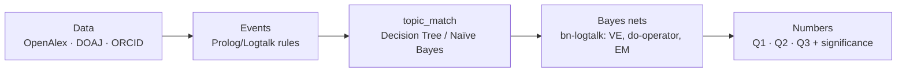

# Author Loyalty in Open-Access Journals

Why do authors publish in a given paid open-access journal? We measure it as three interpretable numbers of the form **observed ÷ expected** — 1.0 = chance level, >1 = genuine attachment.

## The three questions

| Question | Metric | Null model |
|---|---|---|
| **Q1 Repeat ratio** (journal loyalty) | Do authors return to the same journal, beyond what journal size explains? | Redraw each author's journals at random, weighted by journal size |
| **Q2 Publisher excess** (publisher loyalty) | Do authors stay with the same publisher, beyond its market share in the field? | Publisher's market share in the field |
| **Q3 Co-author factor** (co-author path) | Do authors enter journals a co-author used before, adjusted for shared topic? | P1 ÷ P0 via do-operator, plus nested-model test |

## Pipeline

**Scope:** OA journals with APCs in AI/Computer Science, 2015–2024. Important: we need the *complete* publication history of involved authors, not just papers in the target journals.

## Team & ownership

| Person | Role | Area |
|---|---|---|
| Lennart | Logic & events | `logic/` + lead on `fetch/`, `data/` (Data area formally open — confirm at kickoff) |
| Pierre | Machine Learning / topic_match | `topics/` |
| Kevin | Probability & statistics / Bayes nets | `nets/`, `stats/` (lead) + support on OpenAlex filtering strategy |

ProbLog/DeepProbLog PoC (E7): **unassigned — to be settled at kickoff.** It overlaps the logic area (Lennart, who flagged interest) and the probability layer (Kevin); it runs parallel to the event rules, never instead of them.

## Repo structure

| Folder | Content |
|---|---|
| `data/` | prepared tables (gitignored, except schema docs) |
| `fetch/` | retrieval scripts OpenAlex/DOAJ/ORCID |
| `logic/` | Prolog/Logtalk rules + Python counting-path parity check |
| `topics/` | topic_match model (decision tree, Naïve Bayes comparison) |
| `nets/` | bn-logtalk networks + CPTs |
| `stats/` | comparison models, nested-model test |
| `report/` | figures, tables, slides |
| `docs/` | notes, decisions (ADR-light), research notes |

**Branches:** one branch per area (`logic/…`, `topics/…`, `nets/…`, `fetch/…`, `stats/…`), merge requests into protected `main`.

**Research notes:** pitfalls and optional upgrades from prior research (beyond the kickoff slides) are collected in [docs/research-notes.md](docs/research-notes.md) — the slides remain the baseline plan.

**How we work:** coordination is asynchronous through issues rather than fixed meetings — decisions are recorded in the repo, in [docs/decisions.md](docs/decisions.md).

## Milestones

1. **M1 Scope & access** — data access confirmed, target group fixed (field, period), size estimates pulled
2. **M2 Event table** — Prolog events derived, verified against the Python counting path
3. **M3 topic_match** — text model trained and honestly evaluated (cross-validation, confusion matrix)
4. **M4 Numbers & significance** — CPTs estimated, three nets deliver Q1/Q2/Q3, comparison models + significance
5. **M5 Report & defense** — result tables, figures, defense

## Reproducibility

- Fixed random seeds everywhere.
- Pin versions in `requirements.txt` as soon as a package is first used.
- Every number in the report must be traceable back to the raw data.
- The Prolog event derivation must match the independent Python counting path exactly on a sample.
- All numbers repeated on ORCID-verified authors only; difference reported as a robustness check.
- No credentials in the repo: use `.env` (see `.env.example`).
