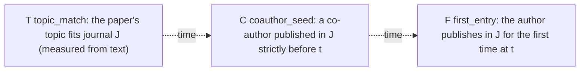
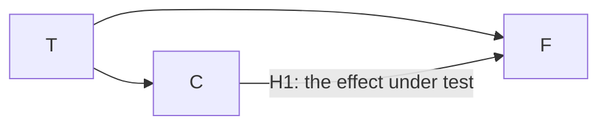
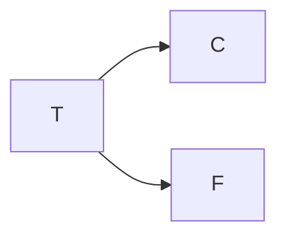
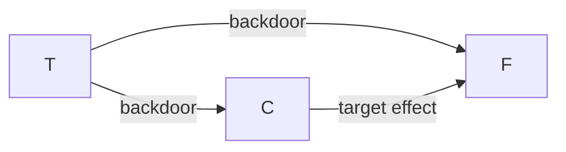

# Q3: structure before parameters

Why this document exists: the week-2 check-in feedback (see [feedback-log.md](feedback-log.md)) was to build the graph first, defend every arrow and every missing arrow, order variables by time, and state hypotheses from logic before any estimation. This is that derivation. No numbers appear here on purpose: parameters come last.

The model under argument is Q3 (co-author factor). One row is one opportunity: an author, a journal J she never published in, a time t.

## 1. The variables in time order

The dotted arrows mark temporal order only, not causation. T reflects the research direction that produced the paper, C is fixed by publication history strictly before t, F happens at t. Causes precede effects, so causal arrows may only point rightward. This alone rules out F to C, F to T, and C to T, before looking at any data.

## 2. Every arrow defended

| Edge | Mechanism for | Strongest objection | Verdict |
|---|---|---|---|
| T -> C | co-authors are found inside one's topic community: if the paper's topic fits J, the people who publish in J are more likely to be among one's co-authors in the first place | the co-author network was formed years earlier, partly outside the current topic | keep: the objection weakens the link but does not remove it, and keeping it is the cautious choice for adjustment |
| T -> F | a fitting topic is a direct reason to submit to J, independent of anyone you know; editors also desk-reject topical misfits | text-measured topic fit may partly proxy other things (e.g. prestige tiers) rather than pure content | keep: the mechanism is direct and uncontroversial; measurement noise is a limitation, not an argument against the edge |
| C -> F | a co-author who published in J knows the journal, can recommend it, may even co-submit there | the whole association could be explained by shared topic, which is exactly H0 below | keep, flagged as the hypothesis under test: this edge IS Q3, the nested test decides |

### The missing arrows are the claims

Deliberately absent from the model:

- author seniority: senior authors have more co-authors and enter more journals, so it could drive both C and F; excluded to keep the net minimal, which assumes seniority acts only through the modeled variables
- shared institution: colleagues share venues and topics; excluded because institution data in our slice is too noisy to condition on reliably
- journal prestige: could attract authors regardless of topic and correlate with where co-authors publish; excluded here, partly picked up by journal identity in Q1/Q2
- conference circles: the same community meets and publishes together; not observable in our data

Each absence is a strong claim: "this factor does not open a second backdoor between C and F". These are assumptions to be stated in the report, not facts.

## 3. The two competing graphs

Full graph:

Reduced graph:

- The full graph is complete (every pair connected), so it implies no independencies and cannot be tested on its own.
- The reduced graph implies exactly one testable statement: F is independent of C given T ("given topic, the co-author connection adds nothing").
- So the hypothesis pair is fixed now, from logic, before any estimation: H0 = the reduced graph is enough. H1 = the C -> F edge is needed. The later nested-model test is exactly this comparison.

## 4. The confounder, visually

Comparing raw entry rates between the with-seed and without-seed groups mixes the backdoor path (C <- T -> F, a fork at T) into the target effect, because the two groups differ in topic composition. Conditioning on T blocks the fork; that is what the do-adjustment does and nothing more.

## 5. Three activities, kept apart

| Activity | Where arrows come from | Hard limits | Role in this project |
|---|---|---|---|
| Causal structure specification | domain knowledge, argued edge by edge | only as good as the arguments; every assumption must be stated | this document, sections 1 to 4 |
| Structure learning | data proposes arrows | Markov equivalence: observational data cannot orient all edges | at most a sanity check on the frozen sample |
| Parameter learning | counting CPTs, given a fixed structure | meaningless if the structure is wrong | the notebook (nets/q3_example.ipynb); it comes last |

## 6. What would change our minds

- If F is independent of C given T in the data, the C -> F edge goes, and Q3 close to 1 is the finding, not a failure.
- If a strong unmodeled confounder is demonstrated, the limitations section grows, or the graph gains a node and the adjustment set changes.
- If topic_match proves too noisy, the adjustment is incomplete and Q3 gets reported as an upper bound, not a point estimate.
